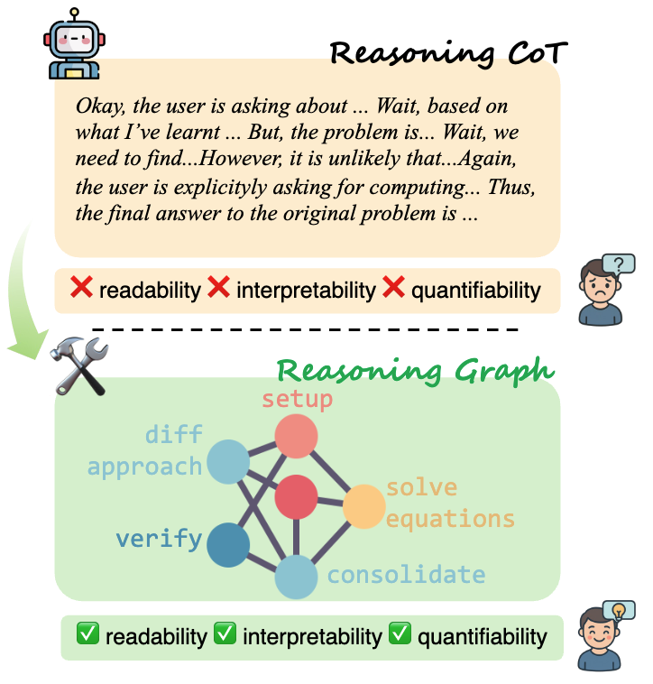
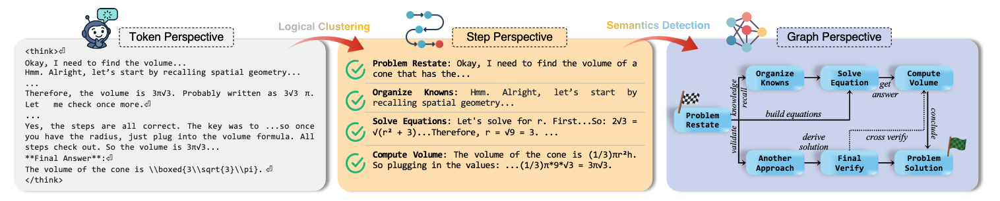

# LLM-MindMap

[](https://arxiv.org/abs/2505.13890)
[](https://eric2i.github.io/LLM-MindMap)

> **Mapping the Minds of LLMs: A Graph-Based Analysis of Reasoning LLMs**  
>Zhen Xiong · Yujun Cai · Zhecheng Li · Yiwei Wang
>Empirical Methods in Natural Language Processing (EMNLP) 2025



This repository implements the analytical framework introduced in *Mapping the Minds of LLMs: A Graph-Based Analysis of Reasoning LLMs*. The toolkit builds the reasoning graph based on the raw chain-of-thought (CoT) traces, enabling quantitative analysis of model cognition beyond coarse token-level statistics.



1. **Unit Segmentation** – split raw CoT transcripts into reasoning units using paragraph boundaries (`\n\n`).  
2. **Logical Clustering** – aggregate adjacent units into semantically coherent reasoning steps, then select the best clustering using the intra-step coherence, step separation, and length regularity criteria.
3. **Semantics Detection** – estimate support/contradiction probabilities for every ordered pair of steps, applying the adaptive sampling scheme and dual-threshold consensus.

## Usage

### 1. Install Dependencies

The default implementation here uses Qwen/Qwen3-32B and the SentenceTransformer `all-mpnet-base-v2`. Ensure you have the necessary compute (80 GB GPU memory is recommended) and appropriate Hugging Face credentials.

```bash
pip install torch transformers accelerate sentence-transformers
```

### 2. Run MindMap

Run the MindMap on any Chain-of-Thought transcript:

```bash
python mindmap.py --input path/to/cot.txt
```

Optional cached JSON payloads can be supplied to bypass live LLM calls:

```bash
python mindmap.py --input path/to/trace.txt \
                  --cluster-json cached_cluster.json \
                  --semantics-json cached_semantics_*.json
```

The MindMap will also print the ordered reasoning steps, the selected graph metrics, and signed edge confidences.

### 3. Graph Metrics

`compute_metrics` reports:

- `exploration_density` – normalised edge density.  
- `branching_ratio` – fraction of steps with out-degree greater than one.  
- `convergence_ratio` – fraction of steps with in-degree greater than one.  
- `linearity` – proportion of steps with total degree ≤ 2.

These metrics provide structural signatures of the reasoning graph.

## Citation

```
@article{xiong2025mapping,
  title={Mapping the Minds of LLMs: A Graph-Based Analysis of Reasoning LLM},
  author={Xiong, Zhen and Cai, Yujun and Li, Zhecheng and Wang, Yiwei},
  journal={arXiv preprint arXiv:2505.13890},
  year={2025}
}
```
